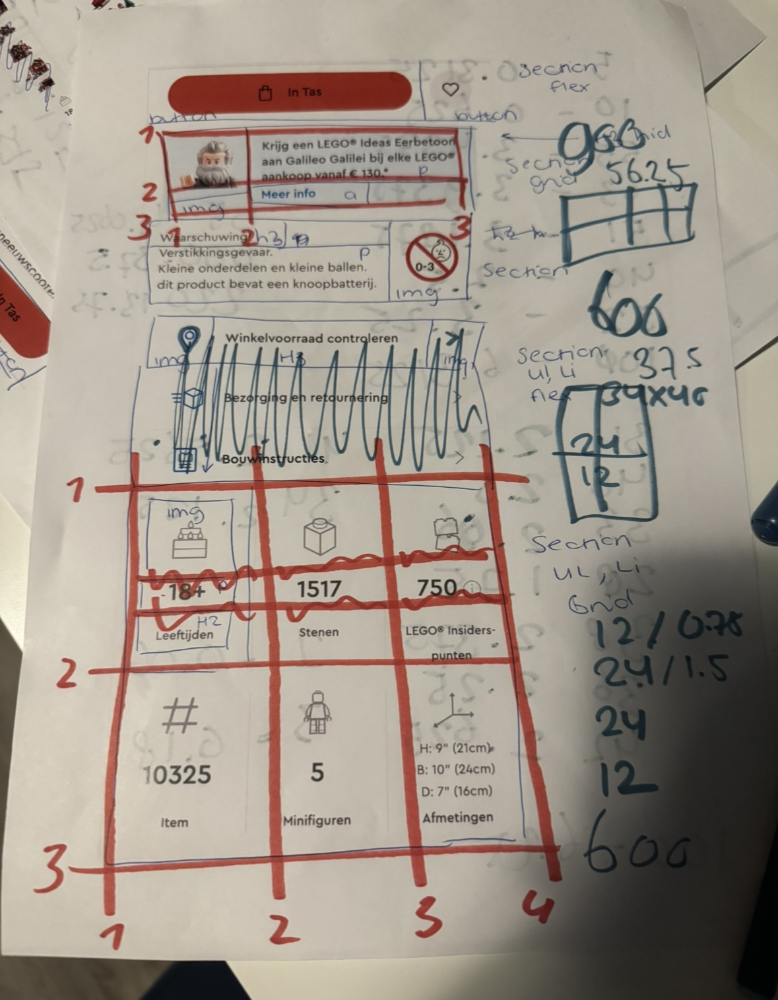
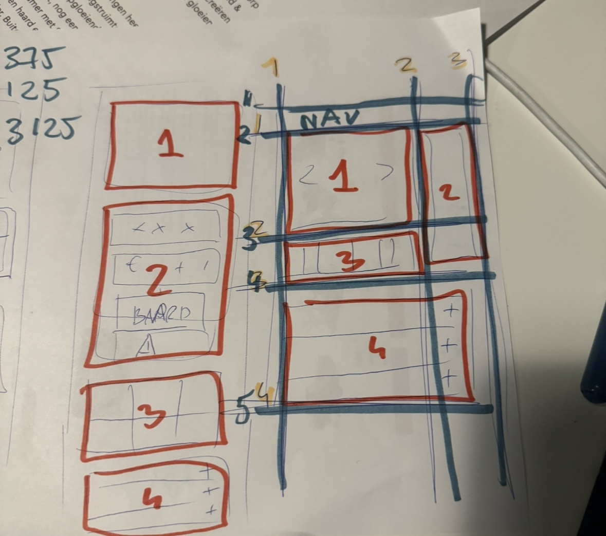
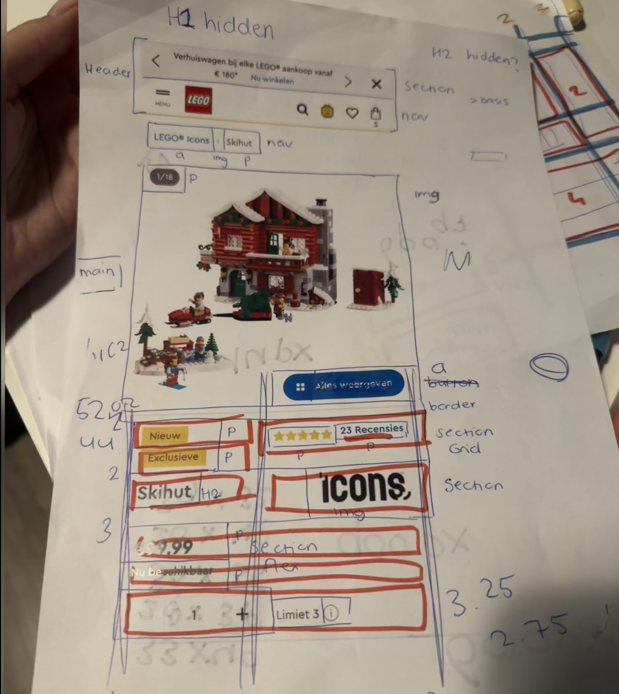
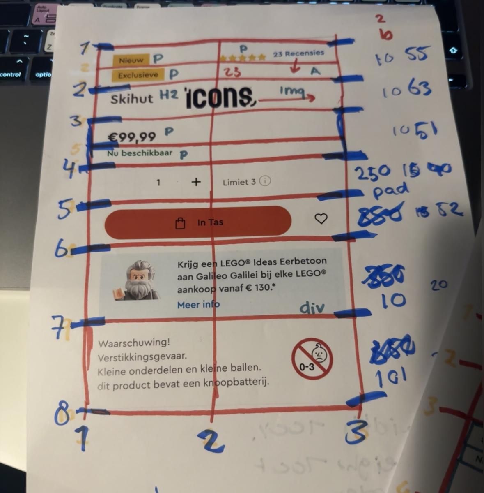
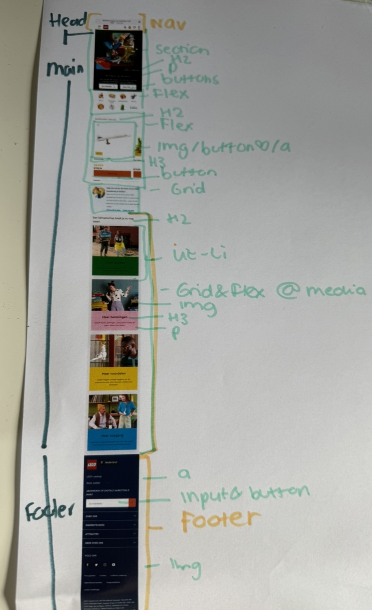
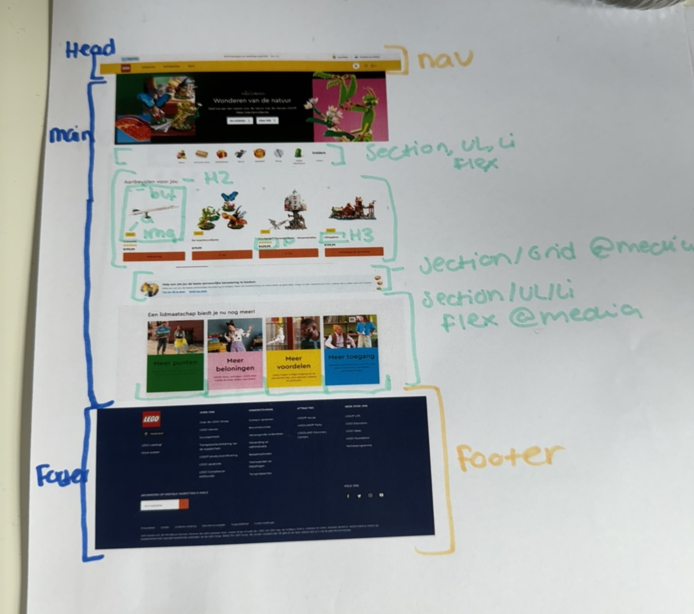
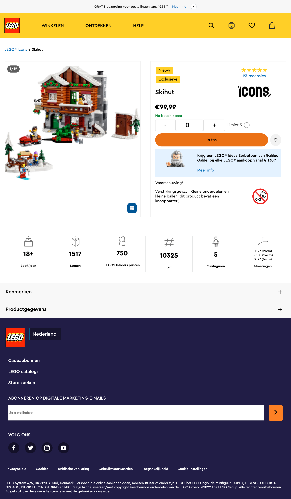

# Procesverslag
Markdown is een simpele manier om HTML te schrijven.  
Markdown cheat cheet: [Hulp bij het schrijven van Markdown](https://github.com/adam-p/markdown-here/wiki/Markdown-Cheatsheet).

Nb. De standaardstructuur en de spartaanse opmaak van de README.md zijn helemaal prima. Het gaat om de inhoud van je procesverslag. Besteedt de tijd voor pracht en praal aan je website.

Nb. Door *open* toe te voegen aan een *details* element kun je deze standaard open zetten. Fijn om dat steeds voor de relevante stuk(ken) te doen.

## Jij

  
uitwerken voor kick-off werkgroep

  ### Auteur:
  Sanne 't Hooft (vervangen door jouw naam)

  #### Je startniveau:
  blauw 

  #### Je focus:
  Responsive 
  

## Je website

  
uitwerken voor kick-off werkgroep

  ### Je opdracht:
  link naar de website die je gaat namaken óf de naam/omschrijving van je eigen ontwerp:
  https://www.lego.com/nl-nl

  #### Screenshot(s) van de eerste pagina (small screen): 
  Homepage 
  

  #### Screenshot(s) van de tweede pagina (small screen):
  Artikel page   
  
 

## Toegankelijkheidstest 1/2 (week 1)

  
uitwerken na test in 2e werkgroep

  ### Bevindingen
- Er zijn heel veel knoppen te vinden. Ook afbeeldingen zijn linken, maar doordat er zoveel "linkjes" zijn is het onduidelijk waar het nu precies voor is.
- De reader geeft aan als er meerdere linken naast elkaar staan.
- Geen H1
- Sommige hover states hebben geen duidelijk kleuren. Zoals bij de eerste section van de hoofdpagina de buttons hadden een zwarte hover, terwijl de achtergrond zwart is.
- kleur contrast is goed. 

## Breakdownschets (week 1)

  
uitwerken na afloop 3e werkgroep

   
  
  
  
  
  

## Voortgang 1 (week 2)

  
uitwerken voor 1e voortgang

  ### Stand van zaken
  hier dit ging goed & dit was lastig (neem ook screenshots op van delen van je website en code)
  Ik wist nog niet helemaal hoe ik aan de gang moest gaan met CSS, maar HTML ging wel goed. 

  ### Agenda voor meeting
Student 1 Chimene 
- Hoe kan ik op de juiste manier afbeeldingen/iconen/knoppen juist downloaden?
- Hoe kan ik de lettertype van mijn website in mijn code krijgen?
- Maakt het uit of je png gebruikt of moet het perse svg zijn?
- Doe ik het juist door classes te gebruiken om meerdere elementen te stijlen?

Student 2 Leanne 
- Hoe maak je een afbeelding van het logo ook hidden H1 in html>?
- Moet er voor de ul een nav?
- Bij H2 "populair" waar doe je de img tag?
- Hoe schrijf ik een bepaald stukje html van de footer?

Student 3 Martin 
- Maakt het uit wat voor soort bestand de afbeelding is? (zelfde als Chimene)
- Hoe houd ik een icoontje op dezelfde plek in het scherm?
- Hoe zorg ik dat iets verdwijnt als ik scroll?
- Welke waardes zijn het handigst om te gebruiken als je alles responsive wilt hebben?

Student 4 Kim 
- Hoe maak je een pauze knop voor een carrousel?
- Hoe maak ik de gekleurde ronde onderkanten bij de sections?
- Hoe loop je een animatie?
- Waarvoor mocht je nou precies wel een class voor gebruiken?           

  ### Verslag van meeting
  hier na afloop snel de uitkomsten van de meeting vastleggen

Veel besproken over HTML code en hoe het netjes kan, maar ook hoe bepaalde elementen werken.
Geen classes gebruikemn, maar :nth-of-type of :first-of-type 

## Voortgang 2 (week 3)

  
uitwerken voor 2e voortgang

  ### Stand van zaken
  hier dit ging goed & dit was lastig (neem ook screenshots op van delen van je website en code)
  - Ik snap nu eindelijk hoe CSS werkt en kan hier zelf ook goed aan de slag mee.
  - Vragen zijn er nog steeds, maar deze stel ik dan en kan dan verder.
  - Java script vind ik nog ingewikkeld. 

  ### Agenda voor meeting
  samen met je groepje opstellen

  
Student 1 Chimene 
- hoe krijg ik twee a’tjes naast elkaar als button
- bij een section werkt flex niet
- hoe moet ik column toepassen op een bepaalde section
- menu knop snap ik niet hoe die werkt

Student 2 Leanne 
- Hoe Connect ik mijn tweede css bestand aan de juiste HTML
- Mijn nav werkt niet `
- Hoe doe ik ook alweer de juiste lettertype importeren 
- Hoe verwijder je iets op GitHub

De website van Leanne is zichtbaar in GitHub en de afbeeldingen zijn te zien.

Student 3 Martin 
- Hoe krijg ik dit icoon helemaal links
- Hoe maak ik dit carousel
- Hoe is dit handig om te maken met grid.
- Moeten alle buttons naar iets leiden?

Student 4 Kim 
- Lettertype toepassen werkt niet bij de  H2 (?)
- background-size: cover; geeft error aan?
- Hoe fix ik de nav button

 

  ### Verslag van meeting
 - nogmaals gekeken naar flex en snap het nu.
  - samen hamburger menu gedaan.

## Toegankelijkheidstest 2/2 (week 4)

  
uitwerken na test in 9e werkgroep

  ### Bevindingen
  - ik heb een H1 hidden toegevoegd. Als de gebruiker voice over gebruikt, dan word de gebruiker eerst welkom geheten.
  - Alle section hebben een H2. Of hij is zichtbaar of hidden. Ook de h3 zijn verwerkt.
  - Hover states duidelijker uitgewerkt met meer kleur contrast. Focus state ook. 
  - Alle buttons hebben een aria label.
  - alle img hebben een alt. 

## Voortgang 3 (week 4)

  
uitwerken voor 3e voortgang

  ### Stand van zaken
  hier dit ging goed & dit was lastig (neem ook screenshots op van delen van je website en code)
  - hamburger menu werkt! Heel blij mee. Nu wel nog stylen.
  - Grootste gedeelte eerste pagina is klaar. Nog wat kleine dingen doen.
  - Beginnen met tweede pagina.
  - Oefenen met @media 

  ### Agenda voor meeting
  samen met je groepje opstellen

Student 1 Chimene 
- meer uitleg over @media Queries.
- wil een border om mijn element, maar ik krijg het niet voor elkaar.
- Jusitify conent lijkt niet te werken
- Hoe krijg ik een afbeelding links en tekst rechts met flex? 

Student 2 Leanne 
- Het juiste lettertype werkt niet
- Hoe doe je de zoekbalk in de header een rij naar onder
- Hoe zet ik de H2 en A (Tickets) op de goede positie
- Hoe verander ik volgorde van afbeelding + plaatje? Met flex? Bij “Uitgelicht”
- Het paarse lijntje onder “Recent bekeken” en “Populair” hoe kan ik dat het beste doen?
- Hoe kan ik het beste het zwarte randje in de header maken? 

Student 3 Martin 
- Hoe zorg ik ervoor dat de nav bar blijft staan
- Mag ik hier classes gebruiken?
- Gebruik van pixels

Student 4 Kim 
- Hoe fix ik de padding bij de icoontjes in de NAV?
- Hoe voeg ik een to top button toe
- Hoe zat het ook en weer met de 2e pagina en de stylesheets?
- webkit-background-clip: text; geeft een error, is dat OK?
- Waar kan ik het beste terecht als ik hierna tegen problemen oploop met Javascript?

  ### Verslag van meeting
  hier na afloop snel de uitkomsten van de meeting vastleggen
  - Samen met Sanne besproken waar ik niet uitkwam.
  - De eerste section @Media uitgelegd gekregen.
  - flex nog verder uitgewerkt. 

## Eindgesprek (week 5)

  
uitwerken voor eindgesprek

  ### Je uitkomst - karakteristiek screenshots:
  
  

  ### Dit ging goed/Heb ik geleerd: 
  - Uit eindelijk had ik echt door hoe HTML en CSS werken, dan is het ook leuk.
  - Flex en Grid snap ik.
  - Het stylen ging ook beter. Ik snap nu meer wat de standaard begrippen zijn van CSS.
  - Ik heb heel veel geleerd, want ik kwam van nul kennis en nu snap ik toch wel hoe het werkt. 

  ### Dit was lastig/Is niet gelukt:
  - Sommige knoppen kreeg ik gewoon niet op de juiste afmeting. Alles geprobeerd, maar niet gelukt. Zoals bijvoorbeeld in de hamburger menu knop "speelplek" en in de footer de input voor email adres button. Deze kreeg ik niet tegen elkaar aan.
  - Ik had veel problemen met dat veel dingen nog op display: block stonden of inline-block. Soms weet ik nog niet hoe ik dingen uit mijzelf kan oplossen, maar ik denk toch dat het aardig gelukt is.
  - geprobeerd om nog animaties toe te voegen bij de in tas, maar ik kreeg het echt niet voor elkaar. Java SCript blijf ik moeilijk vinden en lastig te begrijpen.
  - Als ik ergens tegen aanliep, dan kon ik echt in paniek schieten, misschien daarin mezelf iets rustiger houden. 
  - Toch nog gestructureerder werken. Denk als je dit vaker doet, dat je steeds netter gaat werken en met meer structuur. 

  

## Bronnenlijst

  
continu bijhouden terwijl je werkt

  
  - Ik heb chat gpt gebruikt om soms algemene vragen te stellen. Zoals bijvoorbeeld hoe krijg ik een lijntje onder een link vandaan of hoe krijg ik een ronde border. Vooral in het begin toen ik begon gebruikt.  
  - Lego website inspecter ook gebruikt om soms te kijken hoe zij het gedaan hebben.
  - https://css-tricks.com/snippets/css/a-guide-to-flexbox/
  - https://css-tricks.com/snippets/css/complete-guide-grid/
  - https://codepen.io/Chimenevl/pen/MWLjMrP
  - https://css-tricks.com/almanac/properties/o/overflow/
  - https://getcssscan.com/css-buttons-examples
  - https://getcssscan.com/css-buttons-examples
  - https://codepen.io/cssninjaStudio/pen/GQoGgG/
  - https://codepen.io/frederickallen/pen/NZMEMw
  - https://www.w3schools.com/howto/howto_css_image_center.asp 
  - De extra sessies en hulp van Sanne! 

